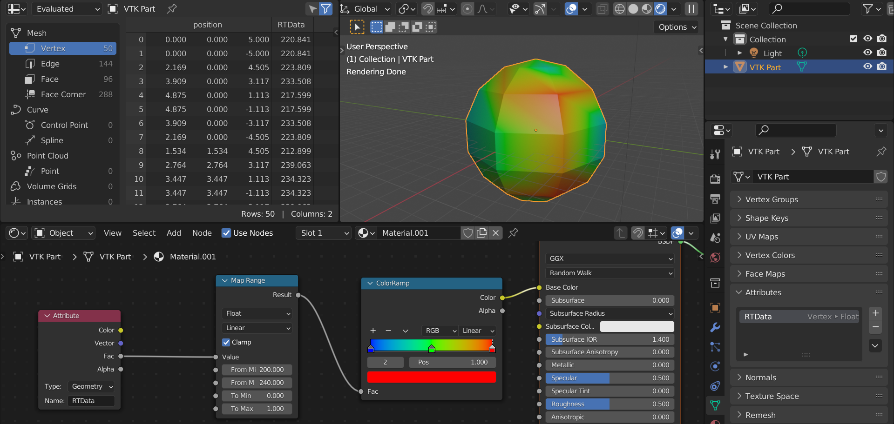
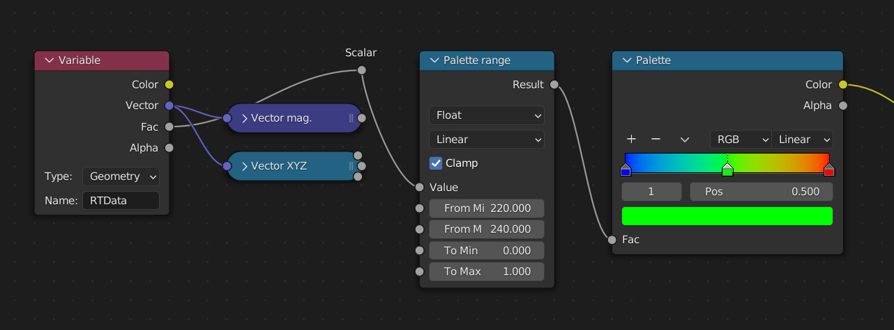
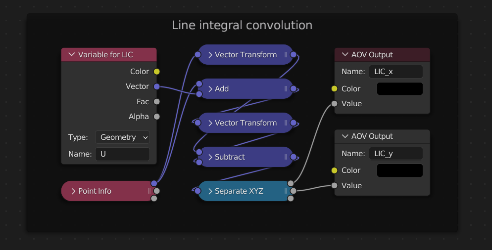

# EnSight Gold reader for Blender

This add-on lets you import geometry and scalar/vector
variable data from EnSight Gold case into Blender,
for scientific or engineering visualization.

### Features

- It's minimal - works with Blender 3.1+ (no extra dependencies
  or special builds needed)
- It's fast - import only parts/variables you need
- It's native - parts are loaded as objects, variables are loaded
  as float vertex attributes (for use with shaders or geometry nodes)

*Above: example case exported from Paraview 5.10 in EnSight Gold format
and imported into Blender 3.1.*

### Installation

1. Download the plug-in ZIP from [GitHub releases page](https://github.com/tkarabela/blender-ensight-reader/releases/)
2. In Blender, go to menu `Edit > Preferences > Add-ons > Install`
   and point it to the ZIP file you downloaded (eg. `blender-ensight-reader-1.1.0.zip`)
3. Enable the add-on by clicking the checkbox next to it.

### Usage

You can load EnSight Gold case from the menu `File > Import > EnSight Gold (*.case)`.
The dialog has several options to specify the data you want to load:

<dl>
  <dt>Time step [integer]</dt>
  <dd>Index of time step to load (0, 1, 2, ...); for non-transient cases, leave this at 0.
      Note that this is <i>not</i> a time value in seconds.</dd>
  <dt>Variables to load [comma-delimited list of names]</dt>
  <dd>Here you can select which variables should be loaded - separate them
      with commas, without spaces (eg. <code>p,U</code>). To load all variables, use <code>*</code>. If you don't
      want to load any variables, leave the field empty.</dd>
  <dt>Parts to include [regular expression]</dt>
  <dd>Only parts containing given expression will be loaded - you can use Python regular expressions.
      To load all parts, leave the field empty. Note that parts containing only
      3D elements will not be loaded in any case, as the add-on creates regular Blender meshes
      which can only contain surface elements.</dd>
  <dt>Parts to exclude [regular expression]</dt>
  <dd>Parts containing given expression will <i>not</i> be loaded - this option takes precedence
      over "Parts to include". To load all parts, leave the field empty.</dd>
</dl>

After the import is finished, the plugin also creates a material called **EnSightMaterial**
which you can use as a starting point for your visualization:

- select which attribute you want to color the part with (for vectors, you can use magnitude or X/Y/Z component)
- define range of your palette
- use default blue-to-red rainbow palette or make your own

The material includes node setup for generating screen-space vectors which can be exported as OpenEXR layers
and then used to add **Line Integral Convolution (LIC)** as a compositing effect in Natron or DaVinci Resolve
using [openfx-lic](https://github.com/tkarabela/openfx-lic).

### Current limitations

- only "scalar per node" and "vector per node" variables are supported
- only "C Binary" EnSight Gold files with unstructured grids are supported
- only 2D elements and 1D `bar2` elements are supported (Blender has no concept
  of unstructured 3D cells; point clouds can be imported from parts with no
  elements or with 0D `point` elements)
- there is no concept of time beyond importing data for a particular time step
  (once the objects are created, you cannot animate the variable data or geometry
  based on other time steps in the original case)
- for more technical details, see [documentation of `ensight-reader`](https://ensight-reader.readthedocs.io/en/latest/api-reference.html#ensightreader.EnsightCaseFile),
  the library used by this add-on

### Other visualization add-ons for Blender

- [**BVTKNodes**](https://bvtknodes.readthedocs.io/en/latest/BVTKNodes.html) is a complex add-on bringing
  data pipelines from the VTK library into Blender, giving it many capabilities of Paraview. It can read EnSight Gold
  cases through the VTK library (selective reading of parts is not supported as of VTK 9.0).
- [**COVISE nodes for Blender**](https://blender.it4i.cz/scientific-visualization/covise/) is another complex add-on
  for scientific visualization, based on COVISE library rather than VTK.
- [**io_mesh_vtk**](https://github.com/tkeskita/io_mesh_vtk) is a simple add-on for reading and writing the VTK legacy
  text format (only polydata).
- [**BlenderDataVis**](https://github.com/Griperis/BlenderDataVis/) is an add-on for creating animated charts in Blender.
